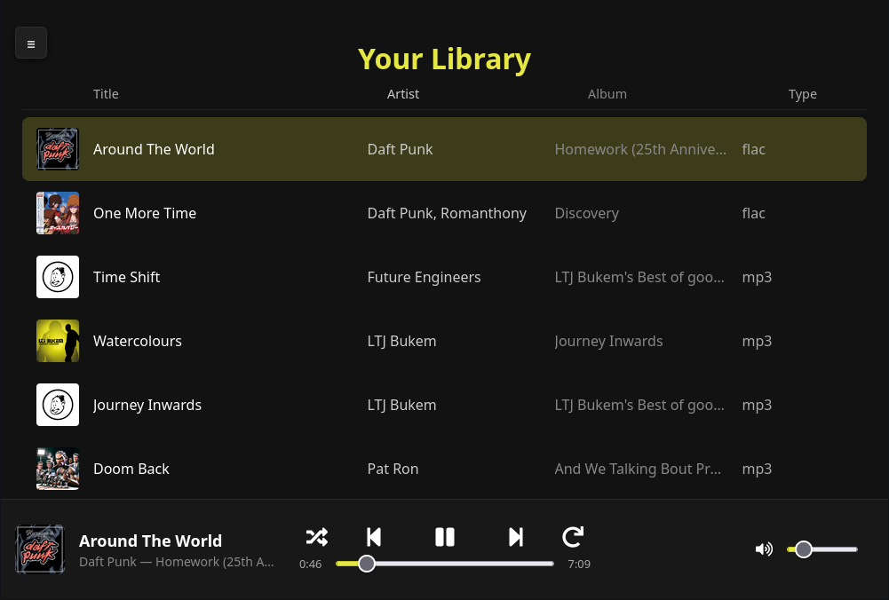

# openstream



Openstream is a lightweight, portable self-hosted music library and streaming server. It scans a user defined music directory, ingests metadata into a SQLite database, and provides a REST API and Web UI for browsing and streaming your music collection.

## Features

- Automatic music library scanning and ingestion
- Web UI for listening and managing the server
- Metadata extraction, including embedded album art
- Metadata editor for tracks
- REST API for tracks, albums, playlists, and artists
- Streaming support for common audio formats (mp3, flac, wav, ogg, m4a)

## Getting Started

### Download the binary

Binaries can be downloaded from the Releases page of this repo.

### Start the server

```bash
# Example with default options
# Music directory and database created in working directory
# Web server hosted on port 9090
./bin/openstream-linux-amd64
```

```bash
# Example - DB_PATH, MUSIC_LIBRARY_PATH, PORT, and WEB_UI_DIR can be customized
DB_PATH=./openstream.db \
MUSIC_LIBRARY_PATH=./music \
WEB_UI_DIR=./webui \
PORT=9090 \
./bin/openstream-linux-amd64
```

The server serves the Flutter web app from a local `webui/` directory by default.
The Flutter client lives in [`flutter/`](flutter), and the Go binary does not embed the web assets.
Ship the `webui/` directory with the binary, or point `WEB_UI_DIR` at another directory that contains the built Flutter web bundle.

`WEB_UI_DIR` defaults to `./webui` relative to the current working directory when the server starts.

Use `scripts/rebuild-web.sh` to clear and rebuild the Flutter web bundle, then resync `webui/`.
Use `scripts/build.sh native` to package the server binary and refresh `webui/` from `flutter/build/web` when it exists.
Use `scripts/package-release.sh all` to build release zip archives that include the binary, `webui/`, `install.sh`, and `openstream.service`.

## Deployment

The included systemd unit is [`scripts/openstream.service`](scripts/openstream.service).
It currently expects these runtime paths:

- binary: `/bin/openstream`
- web UI: `/opt/openstream/webui`
- music library: `/media/music`
- database: `/media/music/openstream.db`
- port: `80`

Build and refresh the packaged assets with:

```bash
scripts/rebuild-web.sh
scripts/build.sh native
```

Create release archives with:

```bash
scripts/package-release.sh all
```

Or for a single target:

```bash
scripts/package-release.sh linux-arm64
```

Each zip contains an `openstream/` folder with everything needed to install from that extracted directory:

- the target binary
- `webui/`
- `install.sh`
- `openstream.service`

Install the binary, web UI, and systemd unit with:

```bash
sudo ./scripts/install.sh
```

`scripts/install.sh` reads the paths directly from [`scripts/openstream.service`](scripts/openstream.service), copies the binary to the unit's `ExecStart` path, copies the web bundle to the unit's `WEB_UI_DIR`, installs the service into `/etc/systemd/system/`, reloads systemd, and enables the service.

If needed, you can override the detected sources when installing:

```bash
sudo BIN_SOURCE=./bin/openstream-linux-amd64 ./scripts/install.sh
```

## Development

### Clone the repo and build from source

```bash
git clone example.git
cd openstream-lite

scripts/rebuild-web.sh

go mod tidy
go build -o ./bin/openstream-linux-amd64 ./cmd/server
```

Or build the packaged binary with:

```bash
scripts/build.sh native
```

### Environment

- `PORT` (default `9090`)
- `DB_PATH` (default `./openstream.db`)
- `MUSIC_LIBRARY_PATH` (default `./music`)
- `LOGO_FALLBACK_PATH` (default empty)
- `WEB_UI_DIR` (default `./webui`)
- `SCAN_INTERVAL` (default `5m`)
- `MAX_UPLOAD_MB` (default `1024`)

### Implemented endpoints

- `GET /health`
- `GET /api/tracks`
- `GET /api/tracks/{id}/stream`
- `POST /api/tracks/upload`
- `PUT /api/tracks/{id}`
- `DELETE /api/tracks/{id}`
- `GET /api/albumart/{fileName}`
- `POST /api/albums/{id}/art`
- `GET /api/playlists`
- `GET /api/playlists/{id}`
- `POST /api/playlists`
- `POST /api/ingestion/scan`
